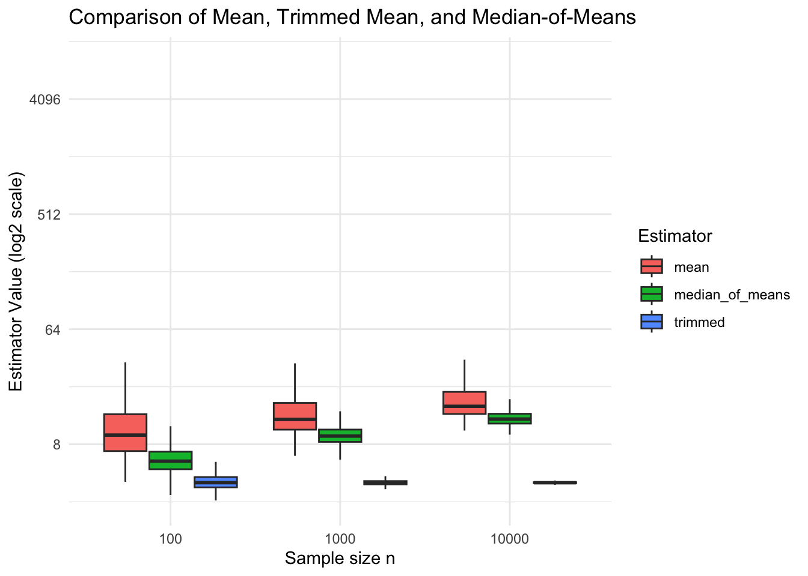
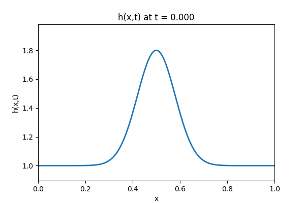
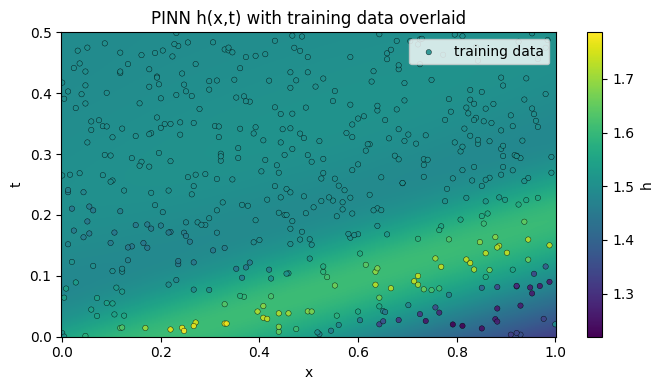
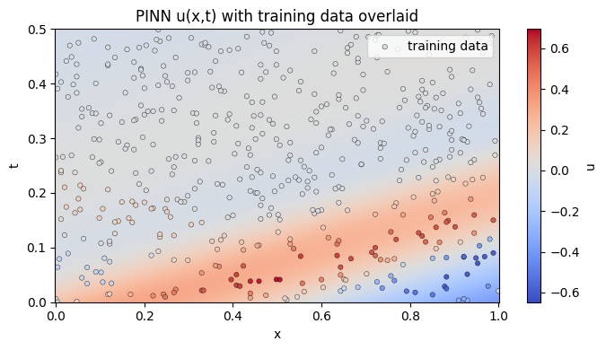
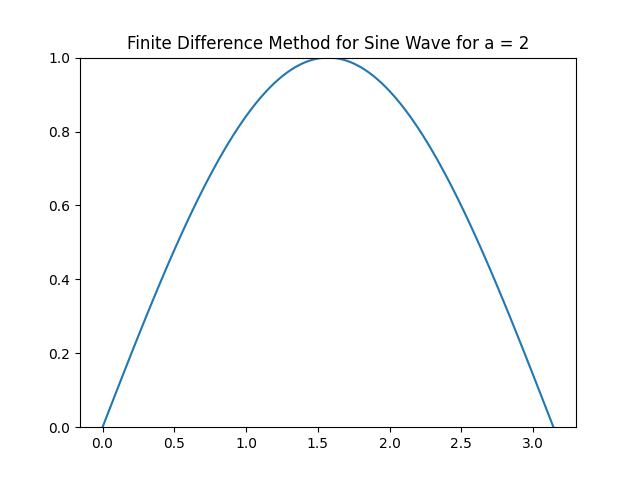
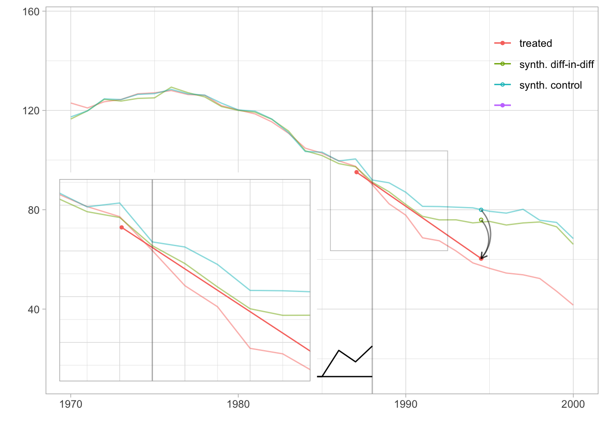

# Course Projects: Simulation, PDEs, Causal Inference, and LLMs

This repository collects several projects from my coursework in
mathematics and statistics at the University of Michigan, Ann Arbor.

---

## 1. Monte Carlo Simulation of the St. Petersburg Game

This is a coding project for **STATS 506**, where I implement simulations
of the St. Petersburg game and document the functions as a custom R
package.

The St. Petersburg game is a classical example where the payoff

$$
X = 2^K, \qquad \mathbb{P}(X = 2^k) = 2^{-k}, \quad k \ge 1
$$

has infinite expectation, yet empirical averages behave very irregularly.
Monte Carlo simulations of repeated plays allow us to visualize and study
the convergence behavior of the sample mean and scaled averages

$$
A_n = \frac{1}{n \log_2 n} \sum_{i=1}^n X_i .
$$

We also discuss the connection of this problem to robust estimation.

---

## 2. PDE Simulation with PINNs and Classical Numerical Methods

This project is related to coursework in **MATH 440**, **MATH 656**, and
**MATH 651**. It focuses on time-dependent PDEs (e.g., the 1D
Saint-Venant / shallow-water system) and compares:

### Physics-Informed Neural Networks (PINNs)

PINNs approximate the solution by minimizing PDE residuals via automatic
differentiation.

| | |
|:--:|:--:|
|  |  |
|  |  |

*Figure 1. Solutions of the 1D Saint-Venant equations using PINNs.*

### Classical Numerical Methods

Classical numerical methods such as finite-volume schemes provide
high-resolution reference solutions.

| | |
|:--:|:--:|
|  |  |

*Figure 2. Solutions from classical numerical simulations.*

The PINN implementation is based on:
https://github.com/maziarraissi/PINNs

---

## 3. Synthetic Difference-in-Differences (SDID) for Causal Inference

This is the final project for **STATS 700**, consisting of a literature
review and implementation of **Synthetic Difference-in-Differences
(SDID)**.

The method is applied to panel data with a treatment introduced at a
known time.

Code templates and examples are adapted from:
https://synth-inference.github.io/synthdid/index.html

---

## 4. Cognitive Tests for LLMs (Work in Progress)

This ongoing project aims to design and build a small demo to compare
multiple benchmark LLMs on semi-independent cognitive tasks.

---

## Requirements

- **R / Quarto**
- **Python**
